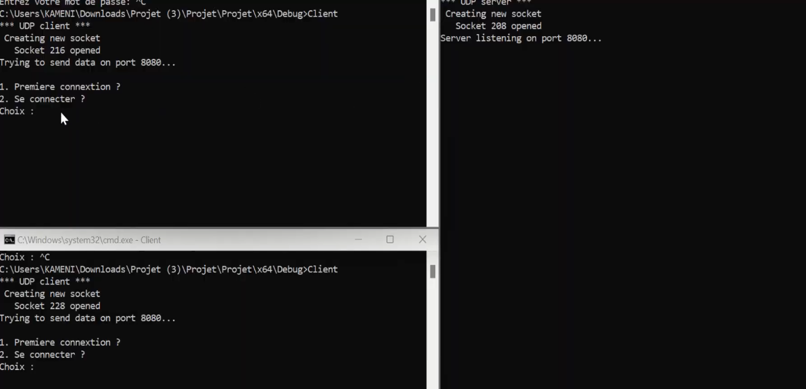
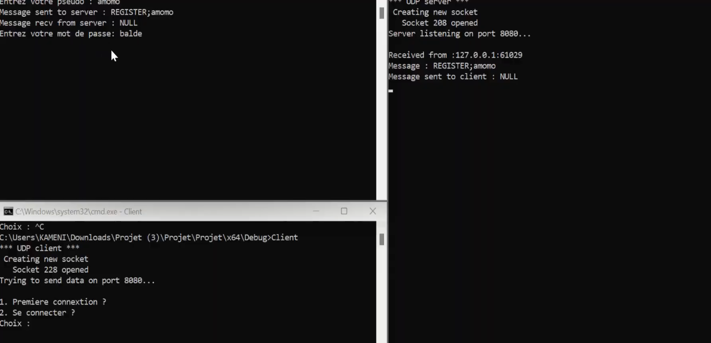
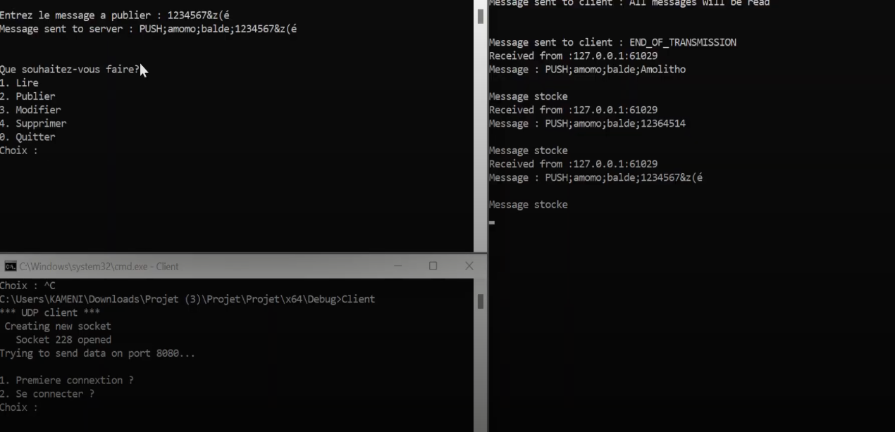
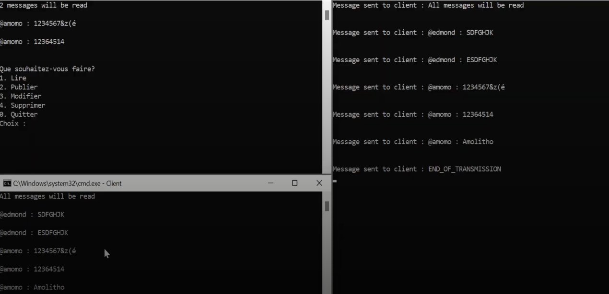

# Forum de Messagerie UDP en C

> _Ce projet implémente un forum de messagerie simple utilisant le protocole UDP en langage C. Le serveur reçoit des messages des clients, les stocke dans une liste chaînée et permet aux clients de récupérer ces messages via des requêtes spécifiques. Les clients peuvent envoyer des messages au serveur (requêtes PUSH) ou récupérer des messages (requêtes PULL) selon certains critères._

## 🧭 Table des matières

- [📸 Démo](#-démo)
- [🚀 Fonctionnalités principales](#-fonctionnalités-principales)
- [📦 Technologies utilisées](#-technologies-utilisées)
- [📁 Structure du projet](#-structure-du-projet)
- [Prérequis](#-prérequis)
- [Extensions possibles](#-extensions-possibles)
- [🛠️ Installation](#️-installation)
- [👤 Auteurs](#-auteurs)
---

## 📸 Démo
La figure suivante montre deux clients qui arrivent sur la page d'acceuil du serveur. Ils ont la possibilité de se connecter ou de s'enregistrer pour commencer à prendre des actions.


La figure ci-dessous montre un client qui s'inscrit sur le serveur en choisissant un pseudo et un mot de passe. Il y a une vérification interne qui est effectuée pour s'assurer que le pseudo soit unique.


L'image d'apès montre les différentes actions qu'un client peuvent prendre.


La figure ci-dessous montre que le connecté a publié un message sur le serveur avec succès.


Enfin, la capture suivante montre deux clients publient en simultanés sur le serveur et peuvent aussi effectuer d'autres actions comme modifier ou supprimer des messages.


---

## 🚀 Fonctionnalités principales

- **Authentification des utilisateurs** : Ajout d'un système de mots de passe simples pour chaque utilisateur.
- **📝 PUSH** : Le client envoie un message qui est stocké sur le serveur. Chaque message est associé à un pseudo d'utilisateur.
- **📜 PULL** : Le client peut demander à lire des messages stockés sur le serveur. Il est possible de spécifier :
  - Un pseudo d'utilisateur pour lire uniquement ses messages.
  - Un nombre de messages à récupérer, avec une préférence pour les messages les plus récents (fonctionnement de type pile - LIFO).
- 🔄 Prise en charge de plusieurs clients
- **Modification et suppression de messages** : Permettre aux utilisateurs de modifier ou supprimer leurs propres messages.

Le serveur fonctionne sur UDP, sans contrôle de flux, et les requêtes sont traitées en temps réel.
---

## 📦 Technologies utilisées

- **Langage principal** : C

---
## Structure du projet

Le projet est divisé en deux parties :
- **Serveur** : Gère l'écoute des clients, le stockage des messages et la réponse aux requêtes.
- **Client** : Permet à l'utilisateur de se connecter au serveur, d'envoyer des messages ou de lire les messages existants.

## Prérequis

- Un compilateur C (par exemple `gcc` ou `clang`).
- Un système UNIX/Linux ou un environnement compatible avec les appels système UNIX (utilisation de `socket()`, `bind()`, `sendto()`, `recvfrom()`).

## Extensions possibles
- **Gestion de sujets** : Organiser les messages par catégories ou fils de discussion.

## 🛠️ Installation

```bash
# 1. Cloner le repo
git clone [https://github.com/tonpseudo/forum-messagerie-udp](https://github.com/Bamolitho/forum-messagerie-udp).git
cd nom-du-projet

# 2. Créer un environnement virtuel (optionnel mais recommandé)
python3 -m venv venv
source venv/bin/activate  # ou .\venv\Scripts\activate sous Windows
```
## 👤 Auteurs
Ce projet a été réalisé en collaboration avec mon camarade Edmond Kameni Junior.
